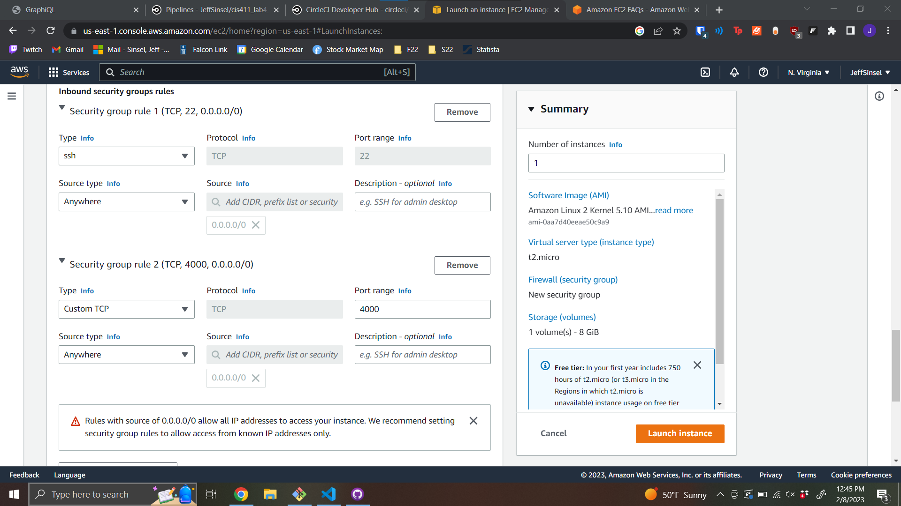
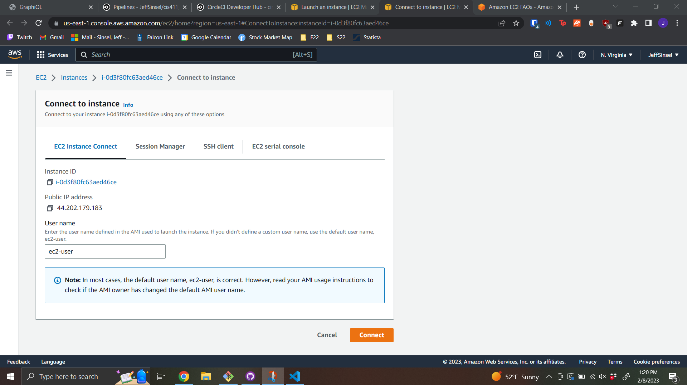
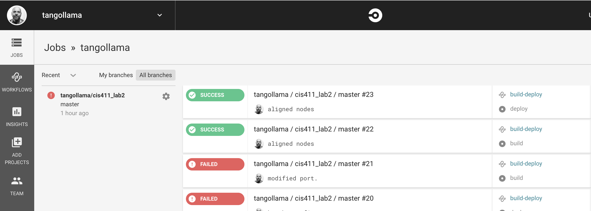

# CIS 411 Lab 4: GitHub + Docker + CircleCI + AWS
The purpose of this lab is to get hands on experience working with Docker, CircleCI, and a Cloud Service Provider like AWS to create a CI/CD pipeline. Though the lab is generally paint by numbers, the hands on experience with the tools is meant to prepare students to improvise on this relatively simple implementation as teams approach CIS 471.

## Submitting work
Lab reports will be submitted by 
1. Generating a markdown file in the labreports directory under the naming convention: **LAB_[GITHUB HANDLE].md**, 
2. Submitting a Pull Request to this repository that include your lab report as well as any accompanying images/files (there are diagrams required in the lab content), and 
3. Providing the URL for that pull request in the Canvas/LMS platform

* Throughout these instructions, you'll find that **items marked in bold text** reference content you are to submit in your lab report.
* For the purposes of clear communication, you may base your lab report off of the template found in [LAB_Template.md](/labreports/LAB_Template.md), but you're also free, welcome, and encouraged to get more creative.

# Step 0: Installing appropriate tools / logins
1. If you don't have a GitHub account already, [create one](https://github.com/join). 
2. [Install _git_](https://git-scm.com/downloads) on your development environment.
3. Install a text editor or some sort of application for local development. Lately, I'm partial to [Visual Studio Code](https://code.visualstudio.com/) and my instructions assume it's use, but you're welcome to deviate. _Each one should choose their own sword, etc. etc._
4. Install Docker on your development environment, either for [Mac](https://docs.docker.com/docker-for-mac/install/), [Windows](https://docs.docker.com/docker-for-windows/install/), or various Linux distributions.  
> If you have Windows Home Edition, then you should following these [instructions](ex/Docker_Installation_Win10_Home.md) to navigate the system requirements.  
5. [Sign up for an account on Docker Hub](https://hub.docker.com/) and keep track of your username and password (You'll need that later).
6. [Sign up for an AWS](https://portal.aws.amazon.com/billing/signup#/start/email) account (You'll need that later too).


# Step 1: Fork and clone this repository
1. After logging in, navigate to the [root](https://github.com/trevordbunch/cis411_lab4_CD) of this repository.
2. Fork this repository to your personal GitHub account (hint: read the page).
3. Navigate to your forked repository in your GitHub account and copy the reference to your repository in from the <button>Clone or Download</button> button.
4. Open the terminal or command line interface on your development machine, navigate to your chosen working directory, and execute the following command: 
```
> git clone [YOUR COPIED GITHUB CLONE REFERENCE]
```

5. Navigate to that directory 
```
> cd cis411_lab4_CD
```

6. Run npm install and watch the magic happen.
```
> npm install
``` 

7. Run the command below and navigate to [http://localhost:4000/graphql](http://localhost:4000/graphql) in a web browser.
```
> npm start
``` 

8. Verify that you can see the GraphQL interface and shut down the server with the use of ```Ctrl+C``` in the command line window that is currently running the ```npm start``` command.

# Step 2: Setup a Continuous Integration configuration
1. [Login into CircleCI](https://circleci.com/vcs-authorize/) or [Sign up to CircleCI](https://circleci.com/signup/) with your GitHub account.
2. Login to CircleCI and add your project to your account (ex. https://circleci.com/add-projects/gh/[YOUR_GITHUB_HANDLE]) by clicking _Add Project_ and selecting your forked repository for cis411_lab4_CD.
3. Follow the setup instructions, including creating the .circleci directory and adding the content below to a config.yml file.

- Create a directory name .circleci in your project 
```
> mkdir .circleci
```
- Add a file to that directory named config.yml ```code .circleci/config.yml```.
- Copy the content below into config.yml.
```
version: 2.1
orbs:
  node: circleci/node@5.1.0
  docker: circleci/docker@2.2.0
  aws-cli: circleci/aws-cli@3.1.1 

jobs:
  test:
    executor: node/default
    steps:
      - checkout
      - node/install-packages:
          pkg-manager: yarn
      - run:
          command: yarn test
          name: Run tests
```
1. Save and add the .circleci directory to your forked repository. **Note: these files must be present in your submitted pull request.**
```
> git add .circleci
> git commit -m "something something circleci something"
> git push
```
5. Verify that the current config file is correct and the project is building in CircleCI.

# Step 3: Create a Dockerfile and run docker commands
1. Create a file in the **root directory** of your repository called **Dockerfile** (no file extension).
2. Add the following content to that file and save it:
```
FROM node:11
WORKDIR /dist
COPY package.json /dist
RUN npm install
COPY . /dist
CMD node server.js
EXPOSE 4000
```
3. Run the following command:
```
> docker login
```
4. Provide your Docker Hub username and password
5. Build and run the Docker image using the following commands from _within_ the cis411_lab4_CD directory:
```
> docker build -t lab4 .
> docker run -p 4000:4000 lab4 
```
> Tip: the period (`.`) at the end of the command is important!  
6. Navigate to http://localhost:4000/graphql and verify that you can access GraphQL.
7. Shutdown the docker container through docker desktop or by running the following command: 
```
> docker stop $(docker ps -aq)
```
8. Add the related **Dockerfile** to your forked repository. **This file must be present in your submitted pull request.**
```
> git add Dockerfile
> git commit -m "something something something Docker something"
> git push
```

# Step 4: Setup a AWS application
There are _lots_ of solutions for providing a CD endpoint including Heroku, Google Cloud, Azure, Digital Ocean, etc. For the purposes of this assignment, we're going to use **AWS** for one reason: it's _relatively_ easy.

1. Login to AWS through your browser and navigate to [AWS EC2](https://us-east-1.console.aws.amazon.com/ec2/home?region=us-east-1#Home:)
2. Once here click the orange <button>Launch Instance</button> button
3. Name the instance lab4 and scroll down to the key pair panel where you will create a new key pair and name it lab4_keys keeping the default settings (RSA,.pem), saving the key pair to your local repo.  Ensure that you include these files in your .gitignore so that you do not expose your credentials in GitHub.
4. Right below that panel is the **Network Setting** and click the <button>Edit</button> button and at the bottom of the panel click the <button>Add security group rule</button> which will create a new rule
     - Set the port to `4000`
     - Set the source type to `Anywhere`
     - Ex. 
5. Launch the instance and then once it is successfully launched you will be brought to the next steps page where you can connect to the instance
6. You will be brought to a page that looks like this: Make sure the tab is EC2 Instance Connect and the username name is ec2-user and then click connect
   - If the connection fails that means the instance is not fully started yet, wait 30 seconds and refresh
7. Copy and paste the commands into the browser terminal (you can paste with right click). If it asks for a yes or no, say yes  
```
sudo yum update -y
sudo amazon-linux-extras install docker
sudo service docker start
sudo usermod -a -G docker ec2-user
sudo chkconfig docker on
```
8. After that finishes, enter `nano script.sh` and copy and paste the code from script.sh into the terminal and change the name. It should look something like this: 
9. Save the script by hitting <button>CTRL + X</button>,<button>Y</button>, and then <button>ENTER</button> to save the script and then enter the command `logout` and close the tab to complete this section

# Step 5: Configure CircleCI for CD to AWS
1. [Open the CircleCI](https://app.circleci.com/) user interface and navigate to: 
```
 Projects > cis411_lab4_CD > Project Settings (gear on the far right) > Environment Variables
```
2. Add the following three environment variables to CircleCI: 
   1. DOCKER_LOGIN > Login to dockerhub account
   2. DOCKER_PASSWORD > Password to dockerhub account
   3. AWS_DOMAIN > [Go to the Instance tab in EC2](https://signin.aws.amazon.com/signin?redirect_uri=https%3A%2F%2Fus-east-1.console.aws.amazon.com%2Fconsole%2Fhome%3FhashArgs%3D%2523%26isauthcode%3Dtrue%26region%3Dus-east-1%26skipRegion%3Dtrue%26state%3DhashArgsFromTB_us-east-1_4d56a6217c8f069d&client_id=arn%3Aaws%3Asignin%3A%3A%3Aconsole%2Fcanvas&forceMobileApp=0&code_challenge=0DKcJQtXURmeqjB2Z3Dw2uUK3R2Bnmt4aDql4k8X4rg&code_challenge_method=SHA-256), click on the instance id number and a page with information about the instance will pop up. Find the Public IPv4 DNS and copy that into this variable

3. In the project setting, there will be another tab called SSH Keys. Scroll down to the bottom to add a key. Take the key that we saved earlier and copy and paste the whole thing (including the dashed items at the top and bottom). This will allow us to connect to AWS. 

4. Open the ```.circleci/config.yml``` file and add the following contents to the end of the file:
```
  build-and-push:
    executor: docker/docker
    steps:
      - setup_remote_docker
      - checkout
      - docker/check
      - docker/build:
          image: ${DOCKER_LOGIN}/lab4
          tag: latest
      - docker/push:
          digest-path: /tmp/digest.txt
          image: ${DOCKER_LOGIN}/lab4
          tag: latest
  
  deploy:
    machine:
      enabled: true
    steps:
      - checkout
      - run: 
          name: Connect and deploy through SSH
          no_output_timeout: 30s
          command: ssh -o "StrictHostKeyChecking no" ec2-user@${AWS_DOMAIN} "
              sudo service docker start;
              bash script.sh;"

workflows:
  lab4-CICD-pipeline:
    jobs:
      - test
      - build-and-push:
          requires:
            - test
      - deploy:
          requires:
            - build-and-push
          filters:
            branches:
              only: main
```
> **TIP:** The indentation is important to how CircleCI understands how to interpret the commands.  Notice that the deployment commands are only applied to the `main` branch.

5. Commit and save those changes and push them to your GitHub repository.
```
> git add *
> git commit -m "Changes something something"
> git push origin master
```
6. Login to CircleCI and **take a screenshot of the successful build and deployment** of your application to AWS.


1. Open up your AWS_DOMAIN and register your account using the following Graphql mutation:
```
mutation {
  mutateAccount(input: {
    email: "YOUR EMAIL"
    name: "YOUR FULL NAME"
    mutation: "add"
  }) {
    id
    name
    email
  }
}
```
If it's not working:
   - The link should look like this replaicing AWS_DOMAIN with the actual domain `http://AWS_DOMAIN:4000/graphql`
   - If it still is not working make sure it's http not https

# Step 6: Reflection / Feedback
Answer the following 4 questions in your [Lab Report](/labreports/LAB_Template.md): 
1. Why would a containerized version of an application be beneficial if you can run the application locally already?
2. If we have the ability to publish directory to AWS, why involve a CI solution like CircleCI? What benefit does it provide?
3. Why would you use a container technology over a virtual machine(VM)?
4. What are some alternatives to Docker for containerized deployments?

# Step 7: Submit your work
Complete a pull request to the source repository and use the PR URL to submit your assignment in canvas.

# Step 8: Extra Credit
Modify the config file so that the Docker image is being pushed and pulled to AWS ECR instead of Dockerhub.