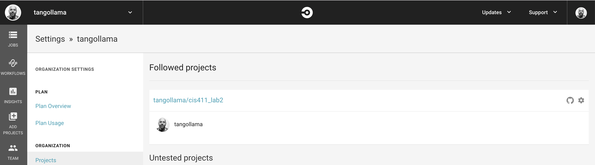

# CIS 411 Lab 4: GitHub + Docker + CircleCI + Google Cloud Run
The purpose of this lab is to get hands on experience working with Docker, CircleCI, and a Cloud Service Provider like Google Cloud Run to create a CI/CD pipeline. Though the lab is generally paint by numbers, the hands on experience with the tools is meant to prepare students to improvise on this relatively simple implementation as teams approach CIS 412.

## Submitting work
Lab reports will be submitted by 
1. Generating a markdown file in the `labreports` directory under the naming convention: **LAB_[GITHUB HANDLE].md**, 
2. Submitting a Pull Request to this repository that include your lab report as well as any accompanying images/files (there are diagrams required in the lab content), and 
3. Providing the URL for that pull request in the Canvas/LMS platform

* Throughout these instructions, you'll find that **items marked in bold text** reference content you are to submit in your lab report.
* For the purposes of clear communication, you may base your lab report off of the template found in [LAB.md](LAB.md), but you're also free, welcome, and encouraged to get more creative.
* If you are unfamiliar with markdown, I recommend checking [1000 places on the Interwebs](http://lmgtfy.com/?q=learn+markdown) that will help you close that gap.

# Step 0: Installing appropriate tools / logins
1. If you don't have a GitHub account already, [create one](https://github.com/join). 
2. [Install _git_](https://git-scm.com/downloads) on your development environment.
3. Install a text editor or some sort of application for local development. Lately, I'm partial to [Visual Studio Code](https://code.visualstudio.com/) and my instructions assume it's use, but you're welcome to deviate. _Each one should choose their own sword, etc. etc._
4. Install Docker on your development environment, either for [Mac](https://docs.docker.com/docker-for-mac/install/), [Windows](https://docs.docker.com/docker-for-windows/install/), or various Linux distributions.  
> If you have Windows Home Edition, then you should following these [instructions](ex/Docker_Installation_Win10_Home.md) to navigate the system requirements.  
5. [Sign up for an account on Docker Hub](https://hub.docker.com/) and keep track of your username and password (You'll need that later).
6. [Link your account with a Google Cloud Project](https://console.cloud.google.com/).  You should use your messiah.edu account and make sure that your register for credits under the Google Cloud for Students (https://cloud.google.com/edu/students) program.


# Step 1: Fork and clone this repository
1. After logging in, navigate to the [root](https://github.com/trevordbunch/cis411_lab4_CD) of this repository.
2. Fork this repository to your personal GitHub account (hint: read the page).
3. Navigate to your forked repository in your GitHub account and copy the reference to your repository in from the <button>Clone or Download</button> button.
4. Open the terminal or command line interface on your development machine, navigate to your chosen working directory, and execute the following command: 
```
> git clone [YOUR COPIED GITHUB CLONE REFERENCE]
```

5. Navigate to that directory 
```
> cd cis411_lab4_CD
```

6. Run npm install and watch the magic happen.
```
> npm install
``` 

7. Run the command below and navigate to [http://localhost:4000/graphql](http://localhost:4000/graphql) in a web browser.
```
> npm start
``` 

1. Verify that you can see the GraphQL interface and shut down the server with the use of ```Ctrl+C``` in the command line window that is currently running the ```npm start``` command.

# Step 2: Setup a Continuous Integration configuration
1. [Login into CircleCI](https://circleci.com/vcs-authorize/) or [Sign up to CircleCI](https://circleci.com/signup/) with your GitHub account.
2. Login to CircleCI and add your project to your account (ex. https://circleci.com/add-projects/gh/[YOUR_GITHUB_HANDLE]) by clicking _Add Project_ and selecting your forked repository for cis411_lab4_CD.
3. Follow the setup instructions, including creating the .circleci directory and adding the content below to a config.yml file.

- Create a directory name .circleci in your project 
```
> mkdir .circleci
```
- Add a file to that directory named config.yml ```code .circleci/config.yml```.
- Copy the content below into config.yml.
```
version: 2
jobs:
  build:  
    docker:
      - image: circleci/node:15
    steps:
      - checkout

      # Download and cache dependencies
      - restore_cache:
          keys:
          - v1-dependencies-{{ checksum "package.json" }}
          # fallback to using the latest cache if no exact match is found
          - v1-dependencies-

      - run: yarn install

      - save_cache:
          paths:
            - node_modules
          key: v1-dependencies-{{ checksum "package.json" }}
        
      # run tests!
      - run: yarn test
```
1. Save and add the .circleci directory to your forked repository. **Note: these files must be present in your submitted pull request.**
```
> git add .circleci
> git commit -m "something something something"
> git push
```
5. Verify that the current config file is correct and the project is building in CircleCI.

# Step 3: Create a Dockerfile and run docker commands
1. Create a file in the **root directory** of your repository called **Dockerfile** (no file extension).
2. Add the following content to that file and save it:
```
FROM node:15
WORKDIR /dist
COPY package.json /dist
RUN npm install
COPY . /dist
CMD node server.js
EXPOSE 4000
```
3. Run the following command:
```
> docker login
```
4. Provide your Docker Hub username and password
5. Build and run the Docker image using the following commands from _within_ the cis411_lab4_CD directory:
```
> docker build -t lab4 .
> docker run -p 4000:4000 lab4 &
```
> Tip: the period (`.`) at the end of the command is important!  
6. Navigate to http://localhost:4000/graphql and verify that you can access GraphQL.
7. Shutdown the docker container by running the following command: 
```
> docker stop $(docker ps -aq)
```
8. Add the related **Dockerfile** to your forked repository. **This file must be present in your submitted pull request.**
```
> git add Dockerfile
> git commit -m "something something something Docker something"
> git push
```

# Step 4: Setup a Google Cloud Run Service (DRAFT - INCOMPLETE)

Google [Cloud Run](https://cloud.google.com/run/) is the Google Cloud Platform (GCP) solution to build and deploy containerized applications.  


1. Login under your messiah.edu account into the Google Cloud (https://console.cloud.google.com/) and setup a project (e.g., `CIS411-Lab4-CD-202301`).  If prompted, choose a computing region of your choice (e.g., `us-east1`).  You will need to know this later for environmental variables.

1. Install the GCP Command Line Interface at https://cloud.google.com/sdk/docs/install.  I downloaded it and extracted it into my project root.  
    - run `./google-cloud-sdk-2/install.sh`  
    - Follow the prompts (You can answer `y` to all unless you already have python installed  - if unsure run `python -V`)

1. Next login to your Google Account by running `./google-cloud-sdk-2/bin/gcloud auth login`  
   
1. initialize the cli to set an active project by 
    - run `./google-cloud-sdk-2/bin/gcloud init`  
    - If you don't already have a gcp profile, Enter a name of the profile, then you may be prompted to login (an OAuth window will open in your browser).  Pick a cloud project (you previously set this up).

1. Complete Cloud Run setup steps (https://cloud.google.com/run/docs/setup), by updating the components.  
     - run `./google-cloud-sdk-2/bin/gcloud components update`  
     - Then update your compute region by running `./google-cloud-sdk-2/bin/gcloud config set run/region east1`  

2. Configure Docker Connection by running the following commands: 
    - run `./google-cloud-sdk-2/bin/gcloud auth configure-docker`  
    - run `./google-cloud-sdk-2/bin/gcloud components install docker-credential-gcr`  

3. Next you need to Deploy to Cloud Run from source (https://cloud.google.com/run/docs/quickstarts/build-and-deploy/deploy-nodejs-service)  
    - Since you should be in the root of your project, you can run the following command to build your docker container (you can call your container whatever you want - I'm calling mine cis411lab4).  `docker build . --tag us-docker.pkg.dev/cloudrun/container/cis411lab4`  
    - Now you can push your docker image to the container registry  `docker push us-docker.pkg.dev/cloudrun/container/cis411lab4`

<span style="color:red">
I'm running into a CLI error at this point, though GCP is registering the build.  My account seems to have all of the necessary permissions.  
</span>  

```
denied: Permission "artifactregistry.repositories.uploadArtifacts" denied on resource "projects/cloudrun/locations/us/repositories/container" (or it may not exist)
```

8. Go to your Cloud Run Service (e.g., https://console.cloud.google.com/run/detail/us-east1/cis411-lab4-cd/), the find the URL for your Service (e.g., https://cis411-lab4-cd-rad5ftddua-ue.a.run.app).  Copy it and add `/graphql` to confirm that the container and application is deployed.

1. **Include this URL in your lab report.**

# Step 5: Configure CircleCI for CD to GCP (DRAFT - INCOMPLETE)

1. Go into Google Cloud IAM and setup a Service Account and establish a key.

2. [Open the CircleCI](https://circleci.com/dashboard) user interface and navigate to: 
```
Settings > Projects > [Click on the Gear icon in the far right corner of this project] > Environment Variables
```


1. Add the following three environment variables to CircleCI: 
    - GCP_PROJECT_KEY generated from the service account in the above step. 
    - GOOGLE_COMPUTE_ZONE = `us-east1` (unless you picked a different region)
    - GOOGLE_PROJECT_ID = `cis411-lab4-cd-202301` (this is found in your project settings)
    - IMAGE_NAME = `cis411lab4` (this is from the above docker commands)

1. Open the ```.circleci/config.yml``` file and add the following contents to the end of the file:
```
build_push_image_cloud_run_managed:
    docker:
      - image: cimg/node:15.1
    steps:
      - checkout
      - setup_remote_docker:
          docker_layer_caching: false
      - run:
          name: Build app binary and Docker image
          command: |
            echo 'export PATH=~$PATH:~/.local/bin' >> $BASH_ENV
            echo ${GCP_PROJECT_KEY} | base64 --decode --ignore-garbage > $HOME/gcloud-service-key.json
            echo 'export GOOGLE_CLOUD_KEYS=$(cat $HOME/gcloud-service-key.json)' >> $BASH_ENV
            echo 'export TAG=${CIRCLE_SHA1}' >> $BASH_ENV
            echo 'export IMAGE_NAME=$CIRCLE_PROJECT_REPONAME' >> $BASH_ENV && source $BASH_ENV
            pip install --user -r requirements.txt
            pyinstaller -F hello_world.py
            docker build -t us.gcr.io/$GOOGLE_PROJECT_ID/$IMAGE_NAME -t us.gcr.io/$GOOGLE_PROJECT_ID/$IMAGE_NAME:$TAG .
      - gcp-gcr/gcr-auth:
          gcloud-service-key: GOOGLE_CLOUD_KEYS
          google-project-id: GOOGLE_PROJECT_ID
          google-compute-zone: GOOGLE_COMPUTE_ZONE
      - gcp-gcr/push-image:
          google-project-id: GOOGLE_PROJECT_ID
          registry-url: "us.gcr.io"
          image: $IMAGE_NAME
      - cloudrun/deploy:
          platform: "managed"
          image: "us.gcr.io/$GOOGLE_PROJECT_ID/$IMAGE_NAME"
          service-name: "orb-gcp-cloud-run"
          region: $GOOGLE_COMPUTE_ZONE
          unauthenticated: true

workflows:
  version: 2
  test_workflow:
    jobs:
      - build
  build_test_deploy:
    jobs:
      - build
      - build_push_image_cloud_run_managed:
          requires:
            - build
          filters:
            branches:
              only: main
```
> **TIP:** The indentation is important to how CircleCI understands how to interpret the commands.  Notice that the deployment commands are only applied to the `main` branch.

5. Commit and save those changes and push them to your GitHub repository.
```
> git add *
> git commit -m "Changes something something"
> git push origin master
```
6. Login to CircleCI and **take a screenshot of the successful build and deployment** of your application to Heroku.


7. Open up your deployed application on Heroku and register your account using the following Graphql mutation:
```
mutation {
  mutateAccount(input: {
    email: "YOUR EMAIL"
    name: "YOUR FULL NAME"
    mutation: "add"
  }) {
    id
    name
    email
  }
}
```

# Step 6: Reflection / Feedback
Answer the following 4 questions in your [Lab Report](/labreports/LAB_Template.md): 
1. Why would a containerized version of an application be beneficial if you can run the application locally already?
2. If we have the ability to publish directory to Heroku, why involve a CI solution like CircleCI? What benefit does it provide?
3. Why would you use a container technology over a virtual machine(VM)?
4. What are some alternatives to Docker for containerized deployments?

# Step 7: Submit your work
Complete a pull request to the source repository and use the PR URL to submit your assignment in canvas.
