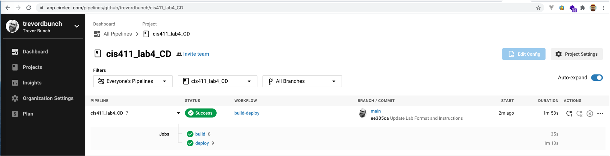

# Lab Report: UX/UI
___
**Course:** CIS 411, Fall 2018  
**Instructor(s):** [Trevor Bunch](https://github.com/trevordbunch)  
**Name:** Trevor Bunch  
**GitHub Handle:** [@trevordbunch](https://github.com/trevordbunch)  
**Repository:** [https://github.com/trevordbunch/cis411_lab4_CD/](https://github.com/trevordbunch/cis411_lab4_CD/)  
**Collaborators:** [Joel Worrall](https://github.com/tangollama/)
___

# Required Content

- [x] Generate a markdown file in the labreports directoy named LAB_[GITHUB HANDLE].md. Write your lab report there.
- [x] Create the directory ```./circleci``` and the file ```.circleci/config.yml``` in your project and push that change to your GitHub repository.
- [x] Create the file ```Dockerfile``` in the root of your project and include the contents of the file as described in the instructions. Push that change to your GitHub repository.
- [x] Write the URL of your running Heroku app here: ```[ex: http://[cis411lab2-tangollama.herokuapp.com/graphql](http://cis411lab2-trevordbunch.herokuapp.com/graphql)```
- [x] Embed _using markdown_ a screenshot of your successful build and deployment to Heroku of your project.

- [x] Answer the questions below.
- [ ] Submit a Pull Request to cis411_lab2 and provide the URL of that Pull Request in Canvas as your URL submission.

## Questions
1. Why would a containerized version of an application be beneficial if you can run the application locally already?
> It is extremely difficult all developers to have an `identical` environment.  The docker container helps to isolate the environmental conditions and allows for consistent behavior.
2. If we have the ability to publish directory to Heroku, why involve a CI solution like CircleCI? What benefit does it provide?
> CircleCI performs tests code at the point when it is committed.  It will can turn away commits that cause errors or fail tests, so that new commits do not breaks the overall system.  In my original CircleCI config - I had an older version of node specified... this was inconsistent with the dependencies and failed!  

3. Why would you use a container technology over a virtual machine(VM)?
> Respond here...
4. What are some alternatives to Docker for containerized deployments?
> Respond here...