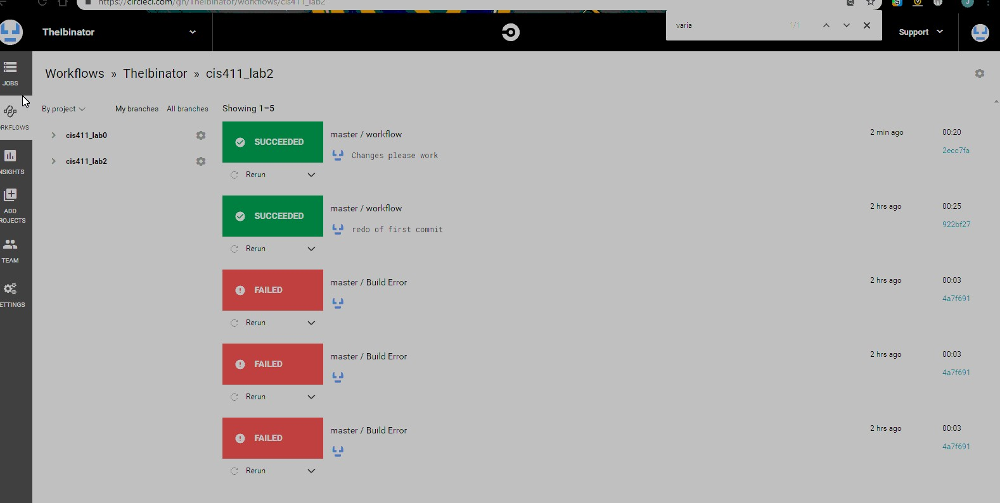
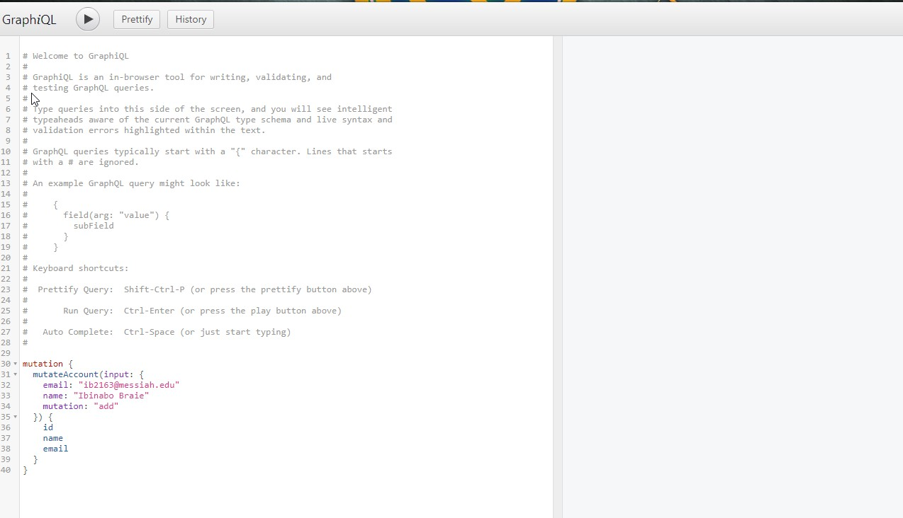

# Lab Report Template for CIS411_Lab2
Course: Messiah College CIS 411, Fall 2018

Instructors: [Joel Worrall](https://github.com/tangollama) & [Trevor Bunch](https://github.com/trevordbunch)

Name: Ibi Braide

GitHub: [TheIbinator](https://github.com/TheIbinator)

# Required Content

1. Generate a markdown file in the labreports directoy named LAB_[GITHUB HANDLE].md. Write your lab report there.
2. Create the directory ```./circleci``` and the file ```.circleci/config.yml``` in your project and push that change to your GitHub repository.
3. Create the file ```Dockerfile``` in the root of your project and include the contents of the file as described in the instructions. Push that change to your GitHub repository.
4. Write the URL of your running Heroku app here:[https://cis411lab2-theibinator2.herokuapp.com/graphql](https://cis411lab2-theibinator2.herokuapp.com/graphql)
5. Embed _using markdown_ a screenshot of your successful build and deployment to Heroku of your project. 

6. Answer the questions below.
7. Submit a Pull Request to cis411_lab2 and provide the URL of that Pull Request in Canvas as your URL submission.

## Questions
1. Why would a containerized version of an application be beneficial if you can run the application locally already?

By running a containerized verision of an application, you create a sort of safety mechanism , when it comes to the different versions of the aplication not being affect by the running version.
You can also make sure that all of those who are testing can do so in the same environment, without having to worry about which operating system they are on.


2. If we have the ability to publish directory to Heroku, why involve a CI solution like CircleCI? What benefit does it provide?

CircleCI provides the benefit of testing if the application will run succesfully without fail. This will decrease the time the user must take 
going through the code and constantly reviewiing what worked and what did not. This makes it so you can seamlessly integrate to a published application when the time comes.
It also allows the user to push out different branches to Heroku, multiple versions, where you can see what progress has been made