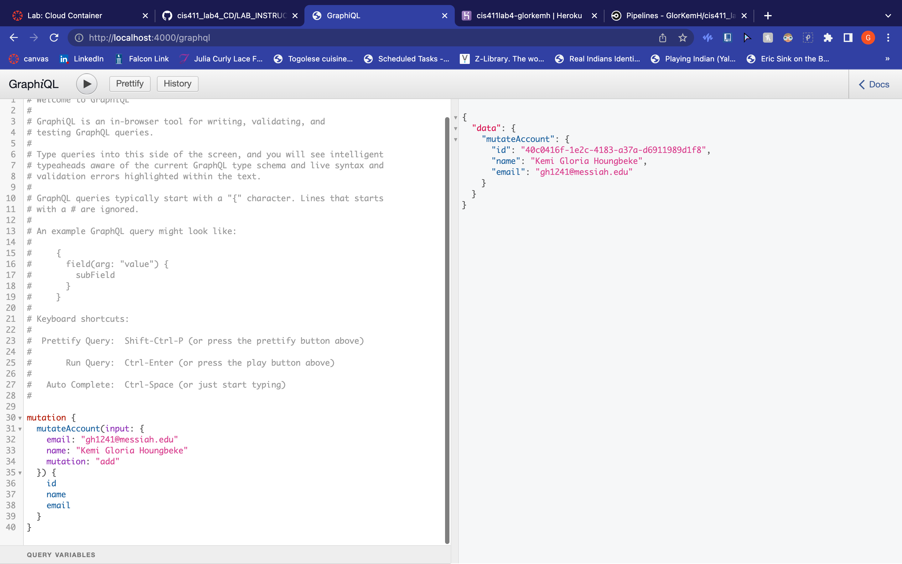

# Lab Report: UX/UI
___
**Course:** CIS 411, Spring 2021  
**Instructor(s):** [Trevor Bunch](https://github.com/trevordbunch)  
**Name:** Gloria Houngbeke  
**GitHub Handle:** GlorKemH
**Repository:** Your Forked Repository  
**Collaborators:** 
___

# Required Content

- [ X] Generate a markdown file in the labreports directoy named LAB_[GITHUB HANDLE].md. Write your lab report there.
- [ X] Create the directory ```./circleci``` and the file ```.circleci/config.yml``` in your project and push that change to your GitHub repository.
- [ X] Create the file ```Dockerfile``` in the root of your project and include the contents of the file as described in the instructions. Push that change to your GitHub repository.
- [ X] Embed _using markdown_ a screenshot of your successful build and deployment to Heroku of your project (with the circleci interface).

! [successful build](../assets/success.png)


> Example: 


- [X ] Write the URL of your running Heroku app here (and leave the deployment up so that I can test it):  

http://cis411lab4-glorkemh.herokuapp.com/graphql


> Example: [http://cis411lab2-trevordbunch.herokuapp.com/graphql](http://cis411lab2-trevordbunch.herokuapp.com/graphql)  
> 




- [ X] Answer the **4** questions below.
- [ X] Submit a Pull Request to cis411_lab4_CD and provide the URL of that Pull Request in Canvas as your URL submission.

## Questions
1. Why would a containerized version of an application be beneficial if you can run the application locally already?
   
This would allow the chance of someone working on the code  well without it affecting the live version, also the chance of a bug affecting the code is significally lower. 


1. If we have the ability to publish directory to Heroku, why involve a CI solution like CircleCI? What benefit does it provide?
> Respond here...

CIrcleCi allows for a quick automanition of the process. It allows checks the code and makes sures that is correct before allowing it to pass to heroku. It helps the develepor work quicker and effienctly.


1. Why would you use a container technology over a virtual machine(VM)?
> Respond here...

Container technology is smaller and faster then a VM. It allows access to all resource in the Os


1. What are some alternatives to Docker for containerized deployments?
> Respond here...

LXC(linux), Artifactory Docker Registry, rkt (works with Kubernetes)

Source: "7 Docker Alternatives And Other Types Of Container Tools | Jfrog". Jfrog, 2022, https://jfrog.com/knowledge-base/the-basics-7-alternatives-to-docker-all-in-one-solutions-and-standalone-container-tools/. Accessed 28 Mar 2022.
