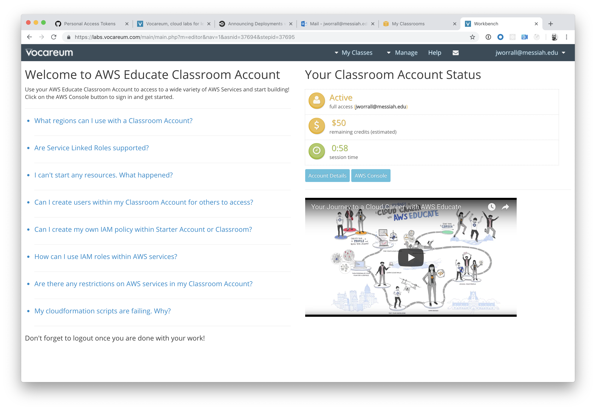

# CIS 411 Lab 2: Docker + CircleCI + AWS ECR & ECS
The purpose of this lab is to get hands on experience working with Docker, CircleCI, and Amazon Web Services to create a CI/CD pipeline. Though the lab is generally paint by numbers, the hands on experience with the tools is meant to prepare students to improvise on this relatively simple implementation as teams approach CIS 412.

## Submitting work
Lab reports will be submitted by 
1. Generating a markdown file in the labreports directory under the naming convention: **LAB_[GITHUB HANDLE].md**, 
2. Submitting a Pull Request to this repository that include your lab report as well as any accompanying images/files (there are diagrams required in the lab content), and 
3. Providing the URL for that pull request in the Canvas/LMS platform

* Throughout these instructions, you'll find that **items marked in bold text** reference content you are to submit in your lab report.
* For the purposes of clear communication, you may base your lab report off of the template found in [LAB.md](LAB.md), but you're also free, welcome, and encouraged to get more creative.
* If you are unfamiliar with markdown, I recommend checking [1000 places on the Interwebs](http://lmgtfy.com/?q=learn+markdown) that will help you close that gap.

# Step 0: Installing appropriate tools / logins
1. If you don't have a GitHub account already, [create one](https://github.com/join). 2. If you don't already have _git_ installed on your development machine, [do so](https://git-scm.com/downloads).
2. Install a text editor or some sort of application for local development. Lately, I'm partial to [Visual Studio Code](https://code.visualstudio.com/) and my instructions assume it's use, but you're welcome to diviate. _Each one should choose their own sword, etc. etc._
3. Install Docker on your local development environment, either for [Mac](https://docs.docker.com/docker-for-mac/install/), [Windows](https://docs.docker.com/docker-for-windows/install/), or various Linux distributions.
4. Be sure that you (signup for an account on Docker Hub)[https://hub.docker.com/] and keep track of your username and password (You'll need that later).
5. You should have received an invitation to an AWS Educate Classroom in your student email. Accept that invitation and [login]() and go to the [classroom](https://labs.vocareum.com/main/main.php?m=editor&nav=1&asnid=37694&stepid=37695). From here, you can access the [AWS Console](https://console.aws.amazon.com/console/home?region=us-east-1#) and the Account Details (which you'll also need later).



# Step 1: Fork this repository
1. After logging in, navigate to the [root](https://github.com/tangollama/cis411_lab2) of this repository.
2. Fork this repository to your personal GitHub account (hint: read the page).

# Step 2: Clone your forked repository from the command line
1. Navigate to your forked repository in your GitHub account and copy the reference to your repository in from the <button>Clone or Download</button> button.
2. Open the terminal or command line interface on your development machine, navigate to your chosen working directory, and execute the following command: ```git clone [YOUR COPIED GITHUB CLONE REFERENCE]```.
3. Navigate to that directory ```cd cis411_lab2```.
4. Run ```npm install``` and watch the magic happen.
5. Run ```npm start``` and navigate to http://localhost:4000/graphql.
6. Verify that you can see the GraphiQL interface and shut down the server with the use of ```Ctrl+C```

# Step 3: Setup a Continuous Integration configuration
1. [Signup for CircleCI](https://circleci.com/signup/) with your GitHub account.
2. Login to CircleCI and add your project to your account (ex. https://circleci.com/add-projects/gh/[YOUR_GITHUB_HANDLE]) by clicking _Add Project_.
3. Follow the setup instructions, including creating the .circleci directory and adding the default config.yml file.

- Create a directory name .circleci in your project ```mkdir .circleci```.
- Add a file to that directory named config.yml ```code .circleci/config.yml```.
- Copy the content for the setup instructions into config.yml.
4. Add the related .circleci files to your forked repository. **These files must be present in your submitted pull request.**

# Step 4: Create a Dockerfile and run docker commands
1. Create a file in the root directory of your repository called **Dockerfile**.
2. Add the following content to that file and save it:
```
FROM node:11
WORKDIR /dist
COPY package.json /dist
RUN npm install
COPY . /dist
CMD node server.js
EXPOSE 4000
```
3. Run the following command:
```
docker login
```
4. Provide your Docker Hub username and password
5. Build and run the Docker image using the following commands from _within_ the cis411_lab2 directory:
```
docker build -t lab2 .
docker run -p 4000:4000 lab2 &
```
6. Navigate to http://localhost:4000/graphql and verify that you can access GraphiQL.
7. Shotdown the docker container by running the following comamnd: 
```
docker stop $(docker ps -aq)
```
8. Add the related **Dockerfile** files to your forked repository. **This file must be present in your submitted pull request.**