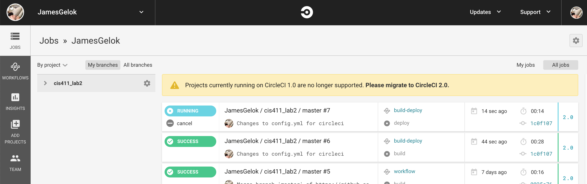
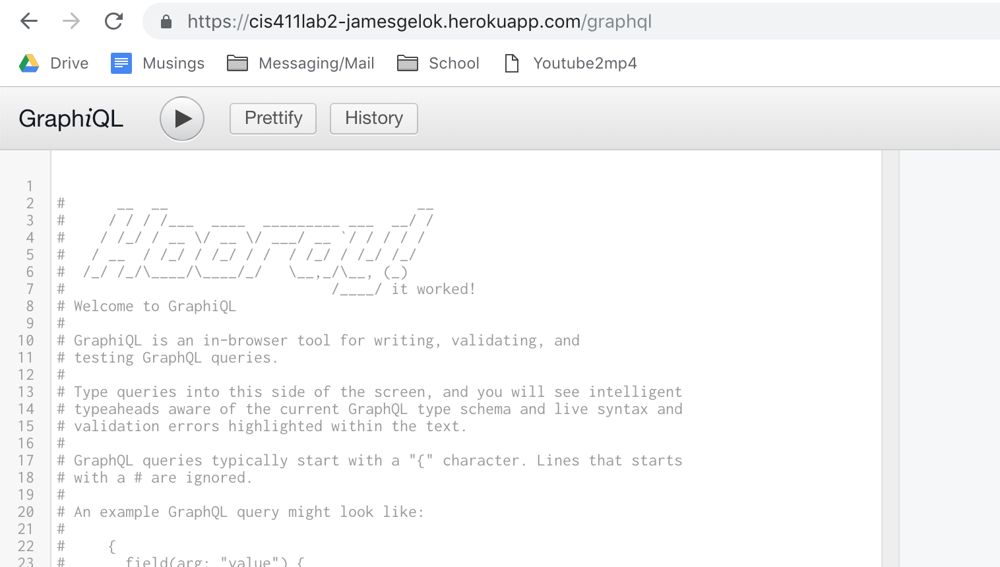

# Lab Report Template for CIS411_Lab2

Course: Messiah College CIS 411, Fall 2018

Instructors: [Joel Worrall](https://github.com/tangollama) & [Trevor Bunch](https://github.com/trevordbunch)

Name: James Gelok

GitHub: [JamesGelok](https://github.com/JamesGelok)

# Required Content

1. ✅ Generate a markdown file in the labreports directoy named LAB\_[GITHUB HANDLE].md. Write your lab report there.
2. ✅ Create the directory `./circleci` and the file `.circleci/config.yml` in your project and push that change to your GitHub repository.
3. ✅ Create the file `Dockerfile` in the root of your project and include the contents of the file as described in the instructions. Push that change to your GitHub repository.
4. ✅ Write the URL of your running Heroku app here: `ex: http://cis411lab2-jamesgelok.herokuapp.com/graphql`
5. ✅ Embed _using markdown_ a screenshot of your successful build and deployment to Heroku of your project.

6. ✅ Answer the questions below.
7. ✅ Submit a Pull Request to cis411_lab2 and provide the URL of that Pull Request in Canvas as your URL submission.

## Questions

1. Why would a containerized version of an application be beneficial if you can run the application locally already?

**Containers package all code and dependencies in an application so that it runs from one software environment to another quickly and reliably. Docker containers allow for the separation of application dependencies from infrastructure. A docker container will reliably house dependencies without much regard to the environment surrounding the container.**

2. If we have the ability to publish directory to Heroku, why involve a CI solution like CircleCI? What benefit does it provide?

**Not only does continuous integration save time, but also they typically run tests on after each submitted change. These tests automatically check code for potential bugs or errors before it gets pushed. Personally I've had projects where my features were rejected because a partner pushed _last-minute_ changes that unfortunately broke the majority of my features; If we had used a continuous integration tool, major code-breaking changes would not have gotten pushed.**
