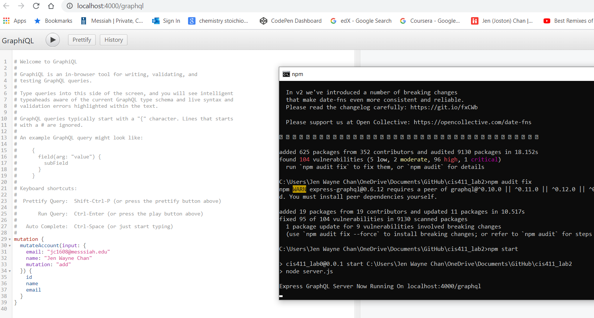
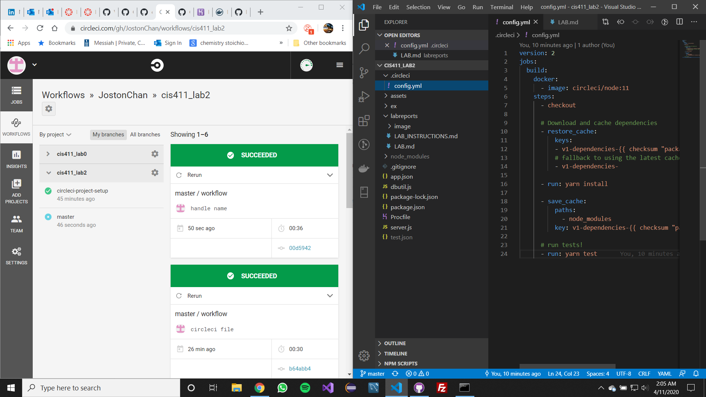
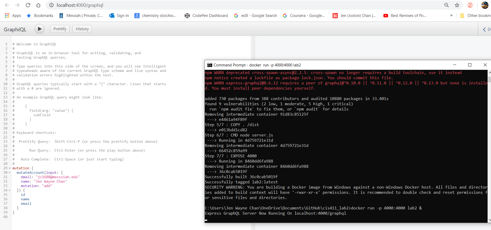
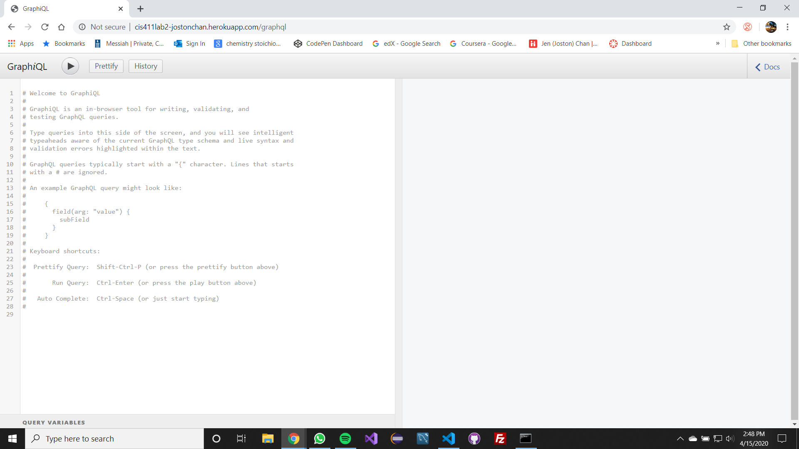
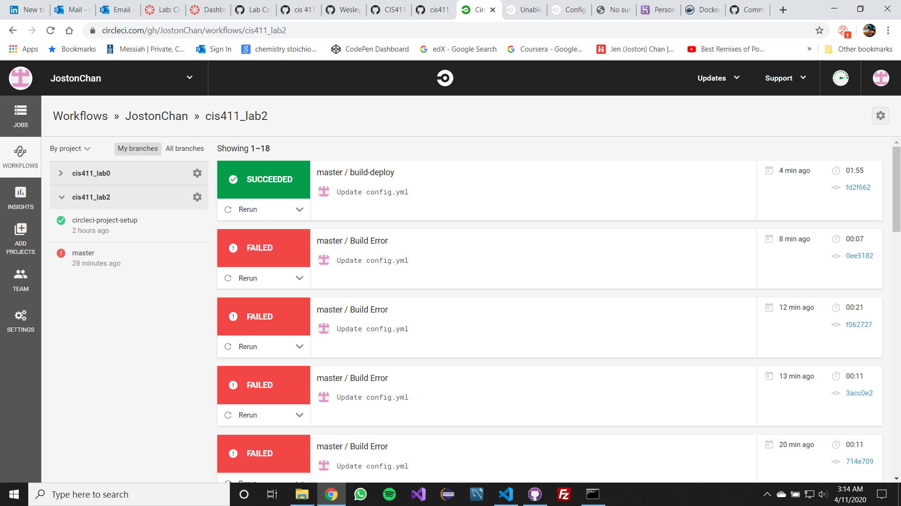

# Lab Report Template for CIS411_Lab2
Course: Messiah College CIS 411, Fall 2020

Instructors: [Joel Worrall](https://github.com/tangollama) & [Trevor Bunch](https://github.com/trevordbunch)

Name: Joston Chan

GitHub: [JostonChan](https://github.com/JostonChan)

# Required Content

1. Generate a markdown file in the labreports directoy named LAB_[GITHUB HANDLE].md. Write your lab report there.
2. Create the directory ```./circleci``` and the file ```.circleci/config.yml``` in your project and push that change to your GitHub repository.



3. Create the file ```Dockerfile``` in the root of your project and include the contents of the file as described in the instructions. Push that change to your GitHub repository.


4. Write the URL of your running Heroku app here: ```http://cis411lab2-jostonchan.herokuapp.com/graphql``` (Heroku does not allow capitalized letters so I can't my GitHub handle, `JostonChan`, so I use `jostonchan`.)


5. Embed _using markdown_ a screenshot of your successful build and deployment to Heroku of your project.


6. Answer the questions below.
7. Submit a Pull Request to cis411_lab2 and provide the URL of that Pull Request in Canvas as your URL submission.

## Questions
1. Why would a containerized version of an application be beneficial if you can run the application locally already?

A containerized version of an application is more beneficial than running it locally because if we build more than one application, the container isolates an application from the host system and from other applications. Not only that, a container provides a consistent environment that allows developers to spend less time debugging the application and more time on creating new functionalities for its users.

2. If we have the ability to publish directory to Heroku, why involve a CI solution like CircleCI? What benefit does it provide?

CircleCI provides continuous integration and continuous deployment of a program. CircleCI test codes that we committed and deem whether the codes are failures or success. If the codes fails, CircleCi prevent the deployment of the program and will allow deployment if it is a success. This relieves developers of their stress of committing new codes to the program because CircleCI provides a layer of security testing. Thus, this helps ensure the integrity of a program and pinpoint errors. 

## Error in Lab instructions:
For the Heroku section, the URL should be 

    http://cis411lab2-[GITHUB_HANDLE].herokuapp.com/graphql

not 

    http://[GITHUB_HANDLE].herokuapp.com/graphql