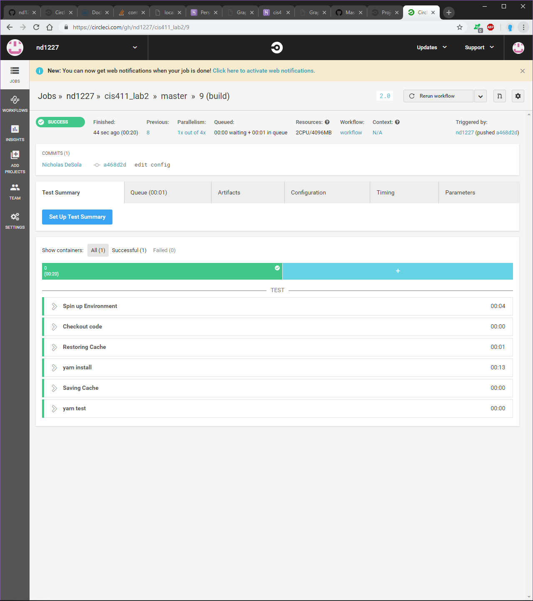

# Lab Report Template for CIS411_Lab2
Course: Messiah College CIS 411, Fall 2018

Instructors: [Joel Worrall](https://github.com/tangollama) & [Trevor Bunch](https://github.com/trevordbunch)

Name: NICHOLAS DESOLA

GitHub: [ND1227](https://github.com/nd1227)

# Required Content

1. Generate a markdown file in the labreports directoy named LAB_[GITHUB HANDLE].md. Write your lab report there.
2. Create the directory ```./circleci``` and the file ```.circleci/config.yml``` in your project and push that change to your GitHub repository.
3. Create the file ```Dockerfile``` in the root of your project and include the contents of the file as described in the instructions. Push that change to your GitHub repository.
4. Write the URL of your running Heroku app here: ```http://cis411lab2-nd1227.herokuapp.com/graphql```
5. 


6. Answer the questions below.
7. Submit a Pull Request to cis411_lab2 and provide the URL of that Pull Request in Canvas as your URL submission.

## Questions
1. Why would a containerized version of an application be beneficial if you can run the application locally already?
    ```
    Running a containerized version of an application allows isolation of the running application, with dependencies of the running application not affecting other local or deployed versions.  These containerized versions will not create conflicts with ech other and, from a security perspective (I had to add this), a security breach in one container will not affect another.  From a compatibility standpoint, any device/machine that can run a Docker container will successful run the application that is running in the container. Docker allows the application to be reproduce among all Docker-running machines.  Also, applications can be seamlessly pushed to production, without errors (assuming the application was built properly).
    ```
2. If we have the ability to publish directory to Heroku, why involve a CI solution like CircleCI? What benefit does it provide?
    ```
    CircleCI provides a stability factor, and allows tests to continue down this "delivery pipeline" if, and only if, they pass the test. This allows for seamless integration to a deployed production application. CircleCI's tools allow for delivry to production that does not affect the currently delivered product; if a test does not pass, then it won't be pushed to Heroku. It's like having a QA supervisor to the tests. Apart from compatibility, CircleCI allows the programmer to push to different branches within Heroku, so there are separate branches for each stage of development (Development, Staging, Production).