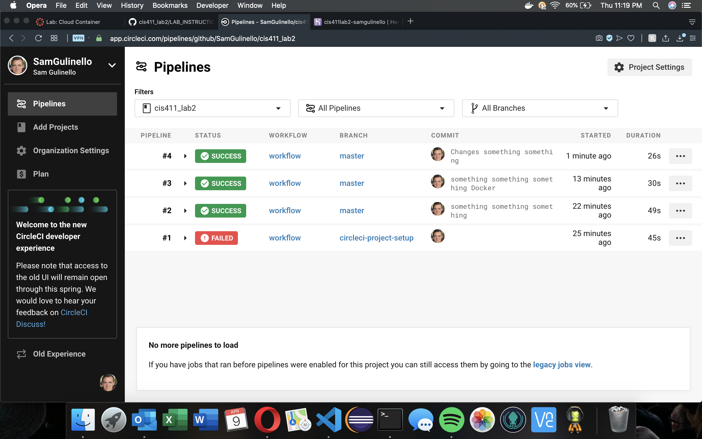

# Lab Report Template for CIS411_Lab2
Course: Messiah College CIS 411, Fall 2018

Instructors: [Joel Worrall](https://github.com/tangollama) & [Trevor Bunch](https://github.com/trevordbunch)

Name: Sam Gulinello

GitHub: [YOUR_HANDLE](https://github.com/SamGulinello)

# Required Content

1. Generate a markdown file in the labreports directoy named LAB_[GITHUB HANDLE].md. Write your lab report there.
2. Create the directory ```./circleci``` and the file ```.circleci/config.yml``` in your project and push that change to your GitHub repository.
3. Create the file ```Dockerfile``` in the root of your project and include the contents of the file as described in the instructions. Push that change to your GitHub repository.
4. Write the URL of your running Heroku app here: http://cis411lab2-samgulinello.herokuapp.com/graphql
5. Embed _using markdown_ a screenshot of your successful build and deployment to Heroku of your project.

6. Answer the questions below.
7. Submit a Pull Request to cis411_lab2 and provide the URL of that Pull Request in Canvas as your URL submission.

## Questions
1. Why would a containerized version of an application be beneficial if you can run the application locally already?

Using a docker container packages up all of the software needed to run the application into a container. These containers are easier to manage and move around. They need to go from a development space to the cloud to other development spaces and eventually to development. All of this moving around can cause an uncontainerized application to get cluttered with unnessecary software and possibly cause it to break. A container keeps this software development environment consistent throughout development.

2. If we have the ability to publish directory to Heroku, why involve a CI solution like CircleCI? What benefit does it provide?

Everytime someone commits changes of a github repo it goes through CircleCI (if you have it set up to do so). What CircleCI does is track these commits and everytime builds the application. If the build of the application is successful, it will then deploy it to services like Heroku. CircleCI adds a system of verification to ensure that the product you are debloying actually works and doesn't fail.

