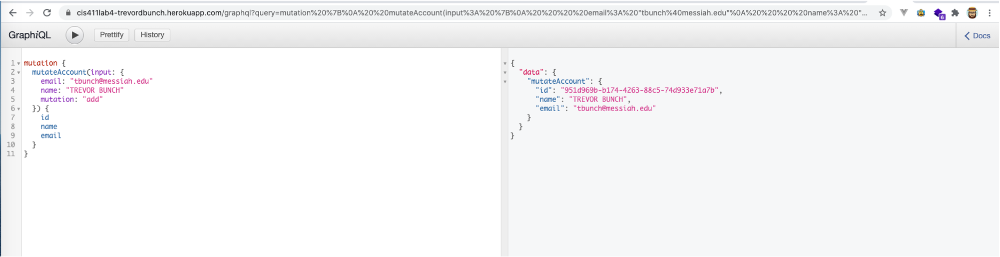

# Lab Report: UX/UI
___
**Course:** CIS 411, Spring 2021  
**Instructor(s):** [Trevor Bunch](https://github.com/trevordbunch)  
**Name:** Your Name  
**GitHub Handle:** Your GitHub Handle  
**Repository:** Your Forked Repository  
**Collaborators:** 
___

# Required Content

- [ ] Generate a markdown file in the labreports directoy named LAB_[GITHUB HANDLE].md. Write your lab report there.
- [ ] Create the directory ```./circleci``` and the file ```.circleci/config.yml``` in your project and push that change to your GitHub repository.
- [ ] Create the file ```Dockerfile``` in the root of your project and include the contents of the file as described in the instructions. Push that change to your GitHub repository.
- [ ] Write the URL of your running Heroku app here:  
> Example: [http://cis411lab2-trevordbunch.herokuapp.com/graphql](http://cis411lab2-trevordbunch.herokuapp.com/graphql)
- [ ] Embed _using markdown_ a screenshot of your successful build and deployment to Heroku of your project.  
> Example: 
- [ ] Answer the **4** questions below.
- [ ] Submit a Pull Request to cis411_lab4_CD and provide the URL of that Pull Request in Canvas as your URL submission.

## Questions
1. Why would a containerized version of an application be beneficial if you can run the application locally already?
> Respond here...
2. If we have the ability to publish directory to Heroku, why involve a CI solution like CircleCI? What benefit does it provide?
> Respond here...
3. Why would you use a container technology over a virtual machine(VM)?
> Respond here...
4. What are some alternatives to Docker for containerized deployments?
> Respond here...