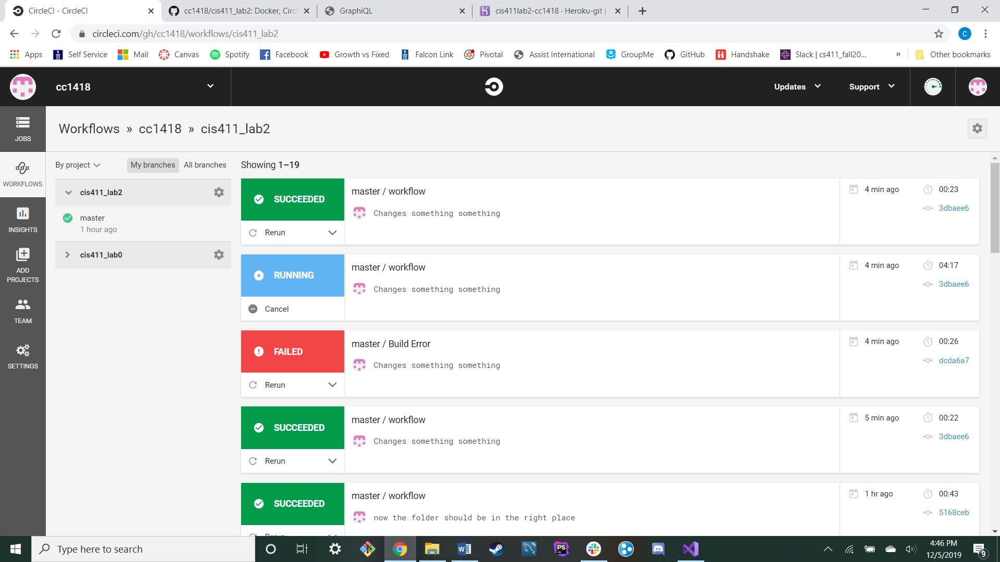

# Lab Report Template for CIS411_Lab2
Course: Messiah College CIS 411, Fall 2018

Instructors: [Joel Worrall](https://github.com/tangollama) & [Trevor Bunch](https://github.com/trevordbunch)

Name: YOUR NAME

GitHub: [YOUR_HANDLE](https://github.com/YOUR_HANDLE)

# Required Content

1. Generate a markdown file in the labreports directoy named LAB_[GITHUB HANDLE].md. Write your lab report there.
2. Create the directory ```./circleci``` and the file ```.circleci/config.yml``` in your project and push that change to your GitHub repository.
3. Create the file ```Dockerfile``` in the root of your project and include the contents of the file as described in the instructions. Push that change to your GitHub repository.
4. Write the URL of your running Heroku app here: ```https://cis411lab2-cc1418.herokuapp.com/graphql```
5. Embed _using markdown_ a screenshot of your successful build and deployment to Heroku of your project.

6. Answer the questions below.<br/>

1. Why would a containerized version of an application be beneficial if you can run the application locally already?
* An application in a container will run the same anywhere. When working on a team, if everything is working within a container on their machine, they don't have to worry about differences in their local environments when performing merges or comparing work. <br/>
2. If we have the ability to publish directly to Heroku, why involve a CI solution like CircleCI? What benefit does it provide?
* A CI solution runs tests on your code and checks that it works. Just because your application is running on your local machine doesn't mean that it will run everywhere. CI solutions help mitigate this issue without the developer needing to think of every posible test to run against their code. <br/>
7. Submit a Pull Request to cis411_lab2 and provide the URL of that Pull Request in Canvas as your URL submission.

## Questions
1. Why would a containerized version of an application be beneficial if you can run the application locally already?
2. If we have the ability to publish directory to Heroku, why involve a CI solution like CircleCI? What benefit does it provide?
