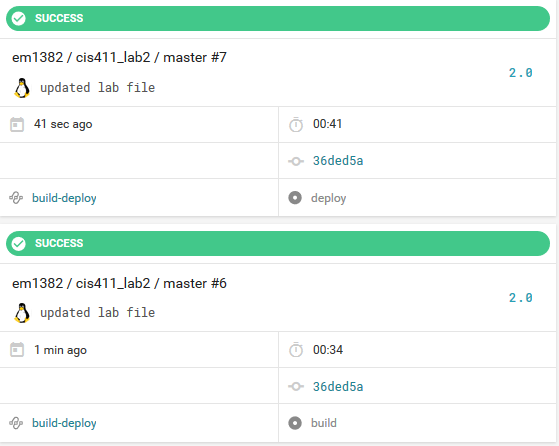

# Lab Report Template for CIS411_Lab2
Course: Messiah College CIS 411, Fall 2018

Instructors: [Joel Worrall](https://github.com/tangollama) & [Trevor Bunch](https://github.com/trevordbunch)

Name: Ellis Madagan

GitHub: [em1382](https://github.com/em1382)

# Required Content

1. Generate a markdown file in the labreports directoy named LAB_[GITHUB HANDLE].md. Write your lab report there.
2. Create the directory ```./circleci``` and the file ```.circleci/config.yml``` in your project and push that change to your GitHub repository.
3. Create the file ```Dockerfile``` in the root of your project and include the contents of the file as described in the instructions. Push that change to your GitHub repository.
4. Write the URL of your running Heroku app here: [Link](http://cis411lab2-em1382.herokuapp.com/graphql)
5. Embed _using markdown_ a screenshot of your successful build and deployment to Heroku of your project.

6. Answer the questions below.
7. Submit a Pull Request to cis411_lab2 and provide the URL of that Pull Request in Canvas as your URL submission.

## Questions
1. Why would a containerized version of an application be beneficial if you can run the application locally already?
A containerized version of an application is beneficial for a variety of reasons, such as simplifying configuration. For example, with a Docker image, you configure once, and your entire environment is shipped with the image, making deployment on a variety of systems a breeze. Another example of a use case of Docker would be code pipeline management. Docker provides a consistent environment for the application from development through production, making the code development and deployment pipeline easier to work with.
2. If we have the ability to publish directory to Heroku, why involve a CI solution like CircleCI? What benefit does it provide?
CircleCI can be set up to run additional steps, like running tests for our application, or doing something with our environment. Therefore, it is beneficial to use it concurrently with Heroku, instead of just pushing to Heroku.
