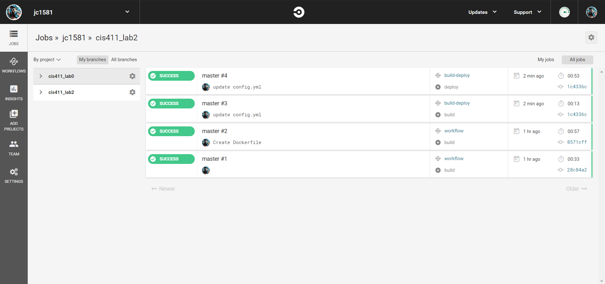
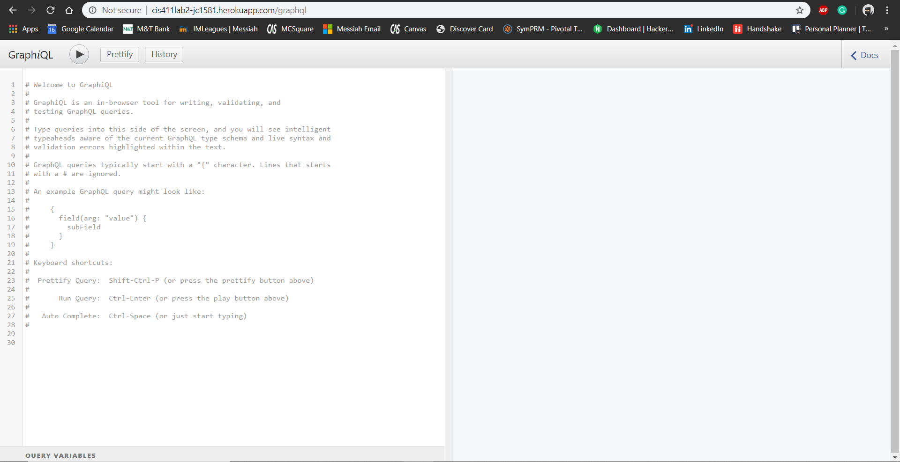

# Lab Report Template for CIS411_Lab2
Course: Messiah College CIS 411, Fall 2019

Instructors: [Joel Worrall](https://github.com/tangollama) & [Trevor Bunch](https://github.com/trevordbunch)

Name: Josh Coldsmith

GitHub: [jc1581](https://github.com/jc1581)

# Required Content

1. Generate a markdown file in the labreports directory named LAB_jc1581.md. Write your lab report there.
2. Create the directory ```./circleci``` and the file ```.circleci/config.yml``` in your project and push that change to your GitHub repository.
3. Create the file ```Dockerfile``` in the root of your project and include the contents of the file as described in the instructions. Push that change to your GitHub repository.
4. Write the URL of your running Heroku app here: ```http://cis411lab2-jc1581.herokuapp.com/graphql```
5. Embed _using markdown_ a screenshot of your successful build and deployment to Heroku of your project.</br>


6. Answer the questions below.
7. Submit a Pull Request to cis411_lab2 and provide the URL of that Pull Request in Canvas as your URL submission.

## Questions
1. Why would a containerized version of an application be beneficial if you can run the application locally already?
    * <strong>Answer</strong>: Running an application in a container allows for much greater usability from one environment to another. It increases speed and reliability without all the hassle of making sure your local machine has all the dependencies that your application may need.
2. If we have the ability to publish directory to Heroku, why involve a CI solution like CircleCI? What benefit does it provide?
    * <strong>Answer</strong>: The benefit of CircleCI is continuous integration. This allows the code that is pushed to be verified through a series of checks and balances before actually changing any code. This can be a life-saver when it comes to preventing mistakes that may break the entire code base.

