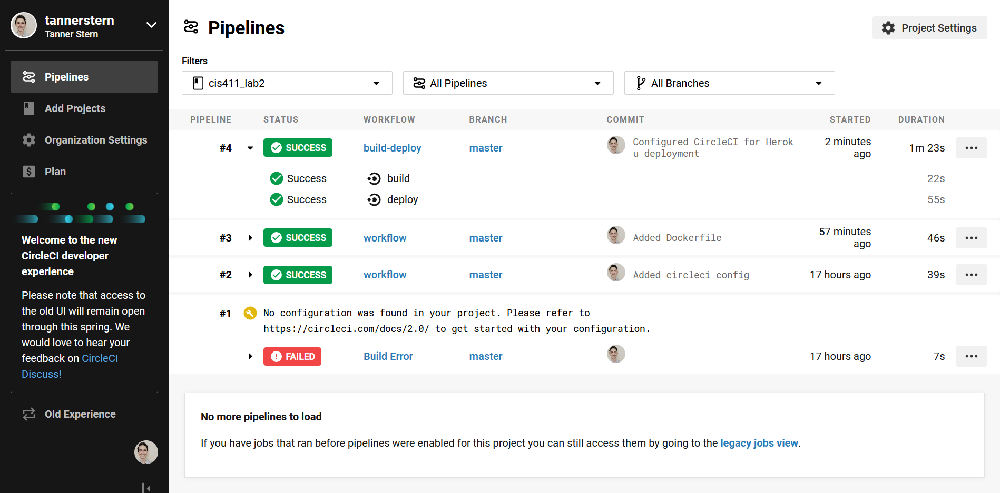

# Lab Report Template for CIS411_Lab2
Course: Messiah College CIS 411, Fall 2018

Instructors: [Joel Worrall](https://github.com/tangollama) & [Trevor Bunch](https://github.com/trevordbunch)

Name: Tanner Stern

GitHub: [tannerstern](https://github.com/tannerstern)

# Required Content

1. Generate a markdown file in the labreports directoy named LAB_[GITHUB HANDLE].md. Write your lab report there.
2. Create the directory ```./circleci``` and the file ```.circleci/config.yml``` in your project and push that change to your GitHub repository.
3. Create the file ```Dockerfile``` in the root of your project and include the contents of the file as described in the instructions. Push that change to your GitHub repository.
4. Write the URL of your running Heroku app here: https://cis411lab2-tannerstern.herokuapp.com/graphql
5. Embed _using markdown_ a screenshot of your successful build and deployment to Heroku of your project.

6. Answer the questions below.
7. Submit a Pull Request to cis411_lab2 and provide the URL of that Pull Request in Canvas as your URL submission.

## Questions
1. Why would a containerized version of an application be beneficial if you can run the application locally already?
   * Containterizing the application allows us to strictly and standardly define the environment in which the application is to run. While a local instance of the application will work, you cannot guarantee a consistent environment each time you build or deploy it.
   * A containerized version of an application can also be made to simulate the delivery endpoint. If you are testing on a Windows machine but the system the application will eventually be deployed on is Linux-based, how can you tell if it will work as epxected? With a container, we have that kind of control.
2. If we have the ability to publish directory to Heroku, why involve a CI solution like CircleCI? What benefit does it provide?
   * Continuous Integration (CI) has the end-goal of improving software quality. When you have multiple developers (or even just one) working on multiple parts of the code-base, you introduce the possibility for bugs and errors that affect other parts of the system. Git helps to coordinate versioning efforts, but it does not solve this problem. Hence, a CI solution like CircleCI is needed to automate testing across multiple stages of development. With CI, errors are detected quickly and can be solved before they are pushed out to production.