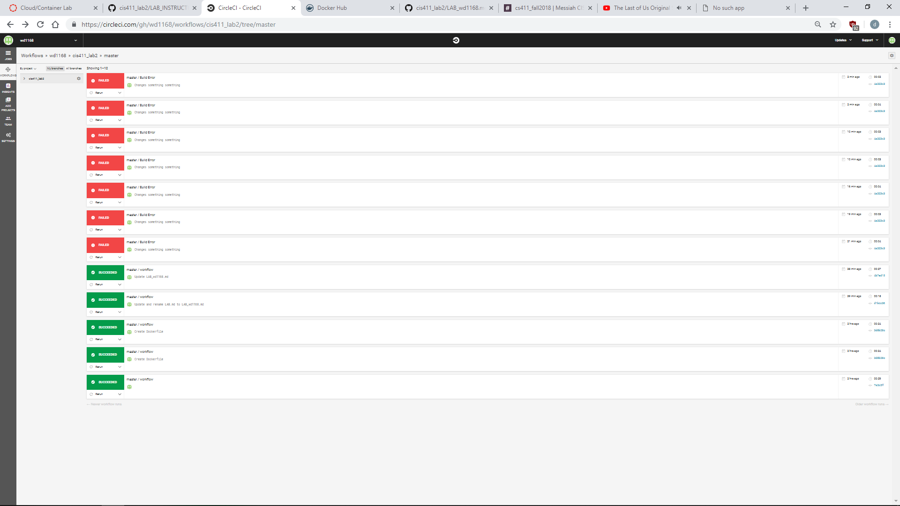

# Lab Report Template for CIS411_Lab2
Course: Messiah College CIS 411, Fall 2018

Instructors: [Joel Worrall](https://github.com/tangollama) & [Trevor Bunch](https://github.com/trevordbunch)

Name: Wyatt Derk

GitHub: [wd1168](https://github.com/wd1168)

# Required Content

1. Generate a markdown file in the labreports directoy named LAB_[GITHUB HANDLE].md. Write your lab report there.
2. Create the directory ```./circleci``` and the file ```.circleci/config.yml``` in your project and push that change to your GitHub repository.
3. Create the file ```Dockerfile``` in the root of your project and include the contents of the file as described in the instructions. Push that change to your GitHub repository.
4. Write the URL of your running Heroku app here: http://wd1168.herokuapp.com/graphql
5. Embed _using markdown_ a screenshot of your successful build and deployment to Heroku of your project.

6. Answer the questions below.
7. Submit a Pull Request to cis411_lab2 and provide the URL of that Pull Request in Canvas as your URL submission.

## Questions
1. Why would a containerized version of an application be beneficial if you can run the application locally already?    
  Ans: With a containerized version, developers do not need to rely on a single machine for development and presentation. 
2. If we have the ability to publish directory to Heroku, why involve a CI solution like CircleCI? What benefit does it provide?
  Ans: Involving a CI enables developers to more actively monitor their project. CI offers a more visually pleasing version control. In     addition, CI is able to communicate whether and update is working within the site or not, thus providing feedback to the developer at a   faster rate.
