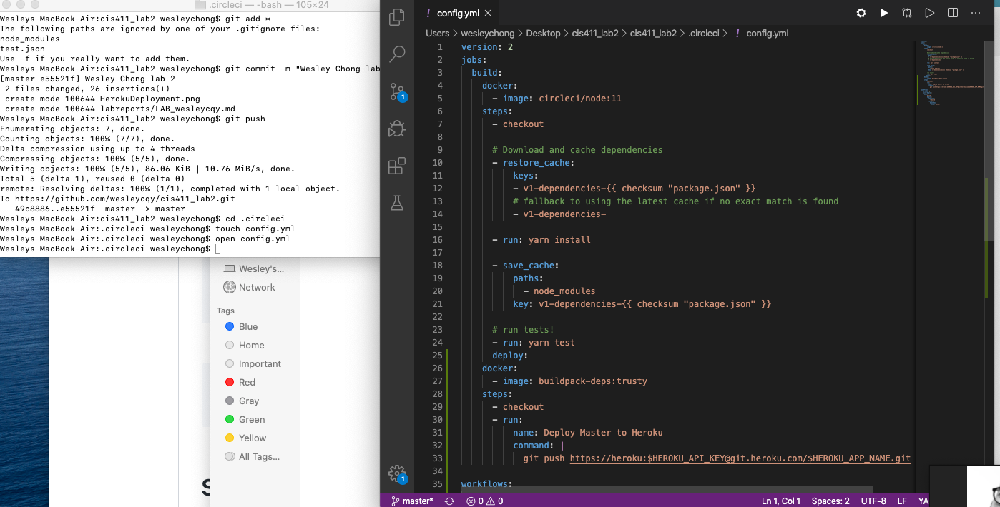
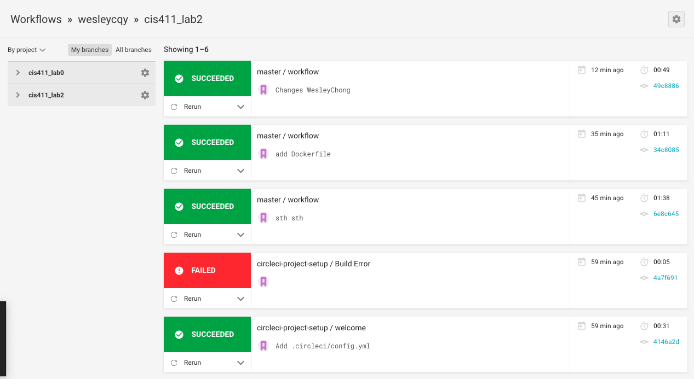

# Lab Report Template for CIS411_Lab2
Course: Messiah College CIS 411, Spring 2020

Instructors: [Joel Worrall](https://github.com/tangollama) & [Trevor Bunch](https://github.com/trevordbunch)

Name: Wesley Chong

GitHub: [wesleycqy](https://github.com/wesleycqy)

# Required Content

1. Generate a markdown file in the labreports directoy named LAB_[GITHUB HANDLE].md. Write your lab report there.
2. Create the directory ```./circleci``` and the file ```.circleci/config.yml``` in your project and push that change to your GitHub repository.
For my .circleci/config.yml file, it does not reflect in my finder. I am not sure if that is a problem, but I know for sure it does exist because it is there when I work with my Terminal. (Eg. If I "cd .circleci" and then "open config.yml", the config.yml file opens for me to populate.)

3. Create the file ```Dockerfile``` in the root of your project and include the contents of the file as described in the instructions. Push that change to your GitHub repository.
4. Write the URL of your running Heroku app here: ```http://cis411lab2-wesleycqy.herokuapp.com/graphql```
5. Embed _using markdown_ a screenshot of your successful build and deployment to Heroku of your project.

6. Answer the questions below.
7. Submit a Pull Request to cis411_lab2 and provide the URL of that Pull Request in Canvas as your URL submission.

## Questions
1. Why would a containerized version of an application be beneficial if you can run the application locally already?
Just because it is running on my machine and system does not mean it will run on another computer's machine and system. A containerized version allows all machines to access and run an application regardless of OS or system. 

2. If we have the ability to publish directory to Heroku, why involve a CI solution like CircleCI? What benefit does it provide?
To constantly check if the code that wants to be published actually is compatible with the code already in Heroku. If not, people would be pushing code that possibly does not work which would be very bad. 
