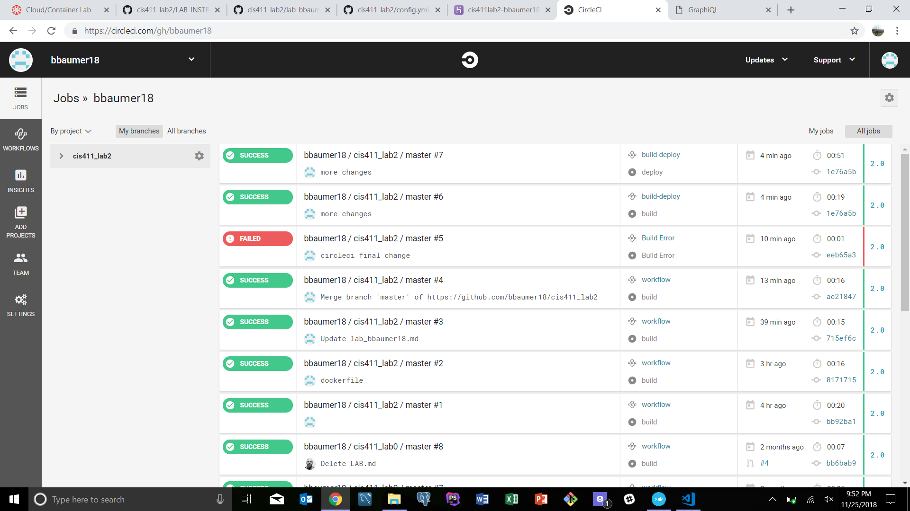

# Lab Report for CIS411_Lab2
Course: Messiah College CIS 411, Fall 2018

Instructors: [Joel Worrall](https://github.com/tangollama) & [Trevor Bunch](https://github.com/trevordbunch)

Name: Brandon Baumer

GitHub: bbaumer18 (https://github.com/bbaumer18)

# Required Content

1. Generate a markdown file in the labreports directoy named LAB_[GITHUB HANDLE].md. Write your lab report there.
2. Create the directory ```./circleci``` and the file ```.circleci/config.yml``` in your project and push that change to your GitHub repository.
3. Create the file ```Dockerfile``` in the root of your project and include the contents of the file as described in the instructions. Push that change to your GitHub repository.
4. Write the URL of your running Heroku app here: https://cis411lab2-bbaumer18.herokuapp.com/graphql
5. Embed _using markdown_ a screenshot of your successful build and deployment to Heroku of your project. 
6. Answer the questions below.
7. Submit a Pull Request to cis411_lab2 and provide the URL of that Pull Request in Canvas as your URL submission.

## Questions
1. Why would a containerized version of an application be beneficial if you can run the application locally already?
    - The benefits of using this is that it creates standardization of environment. This standardized environment can be used throughout the development process to ensure that all developers have the same environment as well as making sure that the environment is the same for development as well as deployment. It reduces the number of issues that arise from different versions of software packages being used in different parts of the process and creates uniformity for development through deployment. 
2. If we have the ability to publish directory to Heroku, why involve a CI solution like CircleCI? What benefit does it provide?
    - It provides the benefit of having a solution that automatically tests code that is added to the master branch and then, assuming that it passes those tests, automatically deploys that code to production. This eliminates the need for someone to manually push that code to production. It enables there to be a lot more updates to the production ready code so that the live product is as up to date as possible. 
